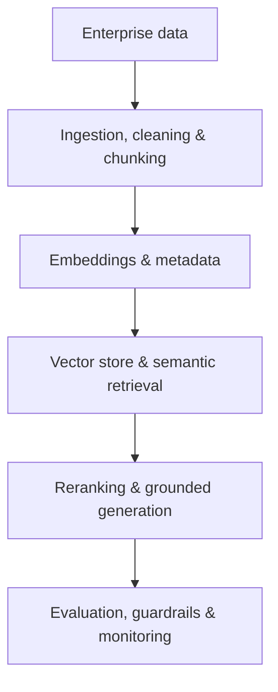
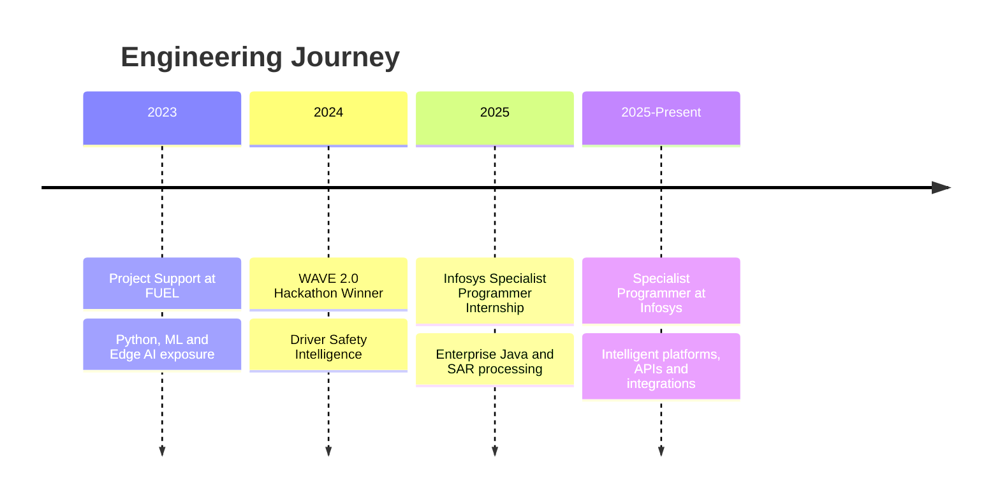

  

**Specialist Programmer at Infosys · B.E. in AI & ML · CGPA 8.62**

I build AI systems that can **learn from data, retrieve knowledge, understand visual environments, and act through software or robots.**

---

[**SYSTEM**](#-system-identity) · [**AI LAB**](#-ai-systems-lab) · [**PROJECTS**](#-project-console) · [**EXPERIENCE**](#-experience-timeline) · [**STACK**](#-technology-control-panel) · [**CONTACT**](#-connect)

---

## 🧬 System Identity

<table>
<tr>
<td width="25%" align="center">
<h3>MODEL</h3>
Machine Learning 
Neural Networks 
Forecasting
</td>
<td width="25%" align="center">
<h3>RETRIEVE</h3>
RAG Pipelines 
Embeddings 
Vector Search
</td>
<td width="25%" align="center">
<h3>SEE</h3>
Computer Vision 
Image Processing 
Visual Intelligence
</td>
<td width="25%" align="center">
<h3>ACT</h3>
Robotics & ROS 
APIs & Agents 
Enterprise Products
</td>
</tr>
</table>

I am building toward one clear role: **AI Enterprise Developer**—an engineer who can move from model experimentation to secure APIs, retrieval systems, databases, deployment, monitoring, and real-world product integration.

## 🧠 AI Systems Lab

### Enterprise RAG Pipeline

<b>What I am developing in this direction</b>

 

- Document ingestion, preprocessing, chunking, and metadata strategies
- Embeddings, semantic search, vector databases, and retrieval quality
- Grounded LLM responses with citations and reduced hallucination
- FastAPI-based AI services, Redis-backed memory, authentication, and caching
- RAG evaluation, observability, guardrails, and agentic workflows
- Local and cloud LLM integration for enterprise applications

**Current exploration:** LangChain · FAISS · Pinecone · Weaviate · Redis · FastAPI · AI Agents

## 🧩 Project Console

Click a project to inspect the system.

<b>🚘 Driver Safety Intelligence — Computer Vision · 94% Accuracy · Hackathon Winner</b>

### Mission

Detect dangerous driver states in real time and trigger immediate intervention.

### Intelligence

- Eye-closure and drowsiness detection
- Yawning detection
- Phone-use detection
- Head-orientation monitoring
- Hands-off-steering detection

### Response Layer

Sound, SMS, and email alerts for rapid intervention.

### Result

**94% accuracy · 1st place at WAVE 2.0 · Team Leader, Team Zealot · ₹25,000 prize**

**Stack:** Python · OpenCV · dlib · imutils · pygame · Twilio

<b>🩺 Kidney Stone Detection — CNN Medical Imaging · 89.88% Accuracy</b>

### Mission

Classify medical images using a convolutional neural network and provide an accessible prediction interface.

### System

- CNN-based image-classification model
- 150×150 image-input pipeline
- Tkinter desktop interface for image selection and prediction
- OpenCV and Pillow preprocessing workflow
- Processed more than 200 images

### Result

**89.88% classification accuracy**

**Stack:** Python · TensorFlow · Keras · CNN · OpenCV · Pillow · Tkinter

<b>🔧 EV Predictive Maintenance — ML + Neural Networks</b>

### Mission

Predict the failure class, affected component, and estimated time to failure before an EV system breaks down.

### Signals

Voltage · Current · Temperature · Vibration · Ambient Temperature · Humidity

### Intelligence

- Random Forest classification for failure and component prediction
- Random Forest regression for time-to-failure estimation
- Neural-network classification and regression architectures
- Thermal, electrical, mechanical, and environmental failure modeling

**Stack:** Python · Scikit-learn · TensorFlow/Keras · Pandas · Random Forests · Neural Networks

<b>🤖 ROS Differential-Drive Robot — Perception-to-Action Systems</b>

### Mission

Build and control a differential-drive robot through ROS while understanding the feedback required for reliable autonomous movement.

### Engineering Challenge

The motors did not provide built-in feedback, creating an open-loop control limitation.

### System Direction

- ROS motion-control integration
- Differential-drive kinematics
- Encoder and sensor feedback architecture
- Odometry and robot-state estimation
- Closed-loop wheel-velocity control

**Focus:** ROS · Motor Control · Sensors · Feedback Systems · Robotics

<b>🛰️ INFYSPACE — SAR Satellite Processing Pipeline</b>

### Mission

Convert raw SAR SLC data into analysis-ready GRD products.

### Pipeline

Orbit correction → Thermal-noise removal → Calibration → Multilooking → Speckle filtering → Terrain correction

**Stack:** Python · ESA SNAP · SAR · Geospatial Data Processing

<b>🎓 Student Admission Prediction — Neural Network · 77.5% Accuracy</b>

- Built a graduate-admission prediction model
- Performed preprocessing, feature handling, neural-network training, and evaluation
- Achieved **77.5% accuracy**

**Stack:** Python · NumPy · Pandas · Neural Networks

<b>⚡ Beckn-Enabled EV Charging Platform — Enterprise Integration</b>

- Built EV-charging interoperability components and standardized API flows
- Worked on charger discovery, booking, reservation, authentication, and live status
- Integrated Beckn-compatible services with CitrineOS and EVerest
- Contributed to database-backed APIs, React interfaces, and Dockerized services

**Stack:** Beckn · FastAPI · React · TypeScript · PostgreSQL · Docker · CitrineOS · EVerest

> Professional work is intentionally summarized at a high level.

<b>📦 More Engineering Work</b>

- **Simple Budget Tracker:** Python application for income, expenses, summaries, categories, records, and savings goals
- **BIRCH Clustering:** Unsupervised learning experiment on the Iris dataset
- **ROC Analysis:** Classification evaluation using the LFW dataset
- **Regression Lab:** Ridge and Lasso experiments
- **SVC Tuning:** Support Vector Classification with hyperparameter optimization
- Data cleaning, ETL, exploratory analysis, and visualization notebooks

## 🧭 Experience Timeline

<b>Specialist Programmer — Infosys</b>

- Building enterprise applications, APIs, integrations, and intelligent workflows
- Working across Python, Java, React, databases, containerized systems, and applied AI
- Contributing to backend architecture, automation, and data-driven optimization

<b>Specialist Programmer Intern — Infosys, Hubli</b>

- Trained in Java, Spring Boot, microservices, REST APIs, JPA, Spring Security, Spring Cloud, React, Redux, and TypeScript
- Applied Python and ML to satellite-data analysis and SAR-processing workflows

<b>Project Support — FUEL, Hubli</b>

- Applied Python and machine learning to data-driven projects
- Gained exposure to edge-AI systems for real-time surveillance and safety applications

## 🎛️ Technology Control Panel

### AI Core

**Machine Learning · Deep Learning · Neural Networks · CNNs · Computer Vision · NLP · Forecasting · Data Analysis · ETL**

### Enterprise AI & Backend

**RAG · Embeddings · Vector Databases · AI Agents · REST APIs · Microservices · OAuth2/JWT · Resilience4j**

### Software & Robotics

**SQL · JavaScript · Redux · Motor Control · Sensors · Git/GitHub · Jupyter · VS Code · ESA SNAP**

<b>Currently strengthening</b>

LangChain · FAISS/Pinecone/Weaviate · RAG Evaluation · Agent Architecture · Kubernetes · Kafka/RabbitMQ · Prometheus · ELK · AWS/Azure

## 🏆 Signals

| Achievement | Result |
|---|---|
| WAVE 2.0 Hackathon | **Winner · Team Leader · ₹25,000 prize** |
| GATE Data Science & AI | **Qualified · AIR 4687 · Score 418** |
| TCS CodeVita Season 12 | **Global Rank 1955 · Cleared Round 1** |
| Infosys | **Secured Specialist Programmer role after internship** |

<b>Certifications</b>

- Google Advanced Data Analytics Specialization
- Google Data Analytics
- Google AI Essentials
- Harvard CS50P — Introduction to Programming with Python
- IBM Machine Learning with Python
- Career Essentials in Software Development — Microsoft & LinkedIn
- Career Essentials in Data Analysis — Microsoft & LinkedIn
- NPTEL Data Analytics with Python — Score: 72%

---

## 🤝 Connect

### Have an AI problem that should become a real system?

  

**AI Enterprise Development · Machine Learning · RAG · Computer Vision · Robotics**

